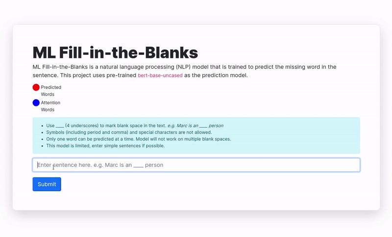

# ML Fill-in-the-Blanks


ML Fill-in-the-Blanks is a natural language processing (NLP) model that is trained to predict the missing word in the sentence. This project uses pre-trained `bert-base-uncased` as the prediction model. 

Learn more about BERT [in this explainer](https://towardsdatascience.com/bert-explained-state-of-the-art-language-model-for-nlp-f8b21a9b6270). [A visual guide](http://jalammar.github.io/a-visual-guide-to-using-bert-for-the-first-time/) is also available for access.

## Details
* Model - `bert-base-uncased`
* Pre-trained task - `MaskedLM`

## Usage
```bash
git clone git@github.com:mabreyes/ml-fill-in-the-blanks.git
cd ml-fill-in-the-blanks
pip install -r requirements.txt
python manage.py migrate
python manage.py collectstatic
python manage.py runserver
```
Visit the site in your local machine at `127.0.0.1:8000`

## Deploying to Heroku
1) Setup Heroku CLI on your local machine. Read about it [here](https://devcenter.heroku.com/articles/heroku-cli#download-and-install).
2) Create Heroku project on your working directory.
```bash
cd ml-fill-in-the-blanks
heroku create <my-project>
```
3) Add files to staging and commit as usual.
```bash
git add .
git commit -m "Initial commit"
```
4) Push to Heroku.
```bash
git push heroku <branch>
```

Site can now be accessed at `https://<my-project>.herokuapp.com`.

## Notes
The attention visualization is done for layer 3 across all attention heads by taking their average. Read more about heads and what they mean  [on this article](https://towardsdatascience.com/deconstructing-bert-part-2-visualizing-the-inner-workings-of-attention-60a16d86b5c1).